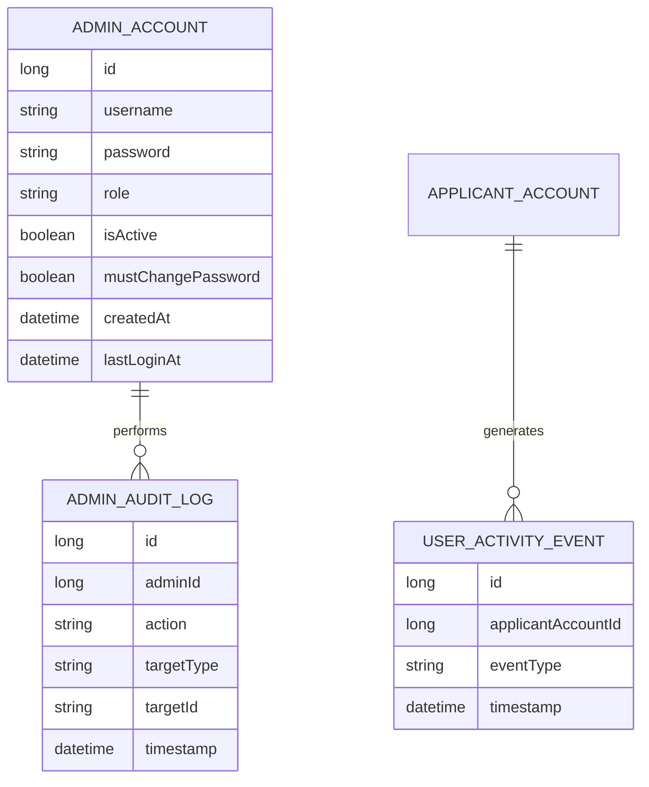

# Feature Specification: Admin UI & Platform Activity Dashboard

**System:** MyCVHub
**Feature ID:** FEAT-ADMIN-01
**Author:** Requirements Engineering (drafted with Claude)
**Status:** Draft v1.1

---

## 1. Purpose & Scope

MyCVHub currently has no way for the operators of the platform to observe how it is being used or to manage the accounts that use it. This feature introduces:

1. A new **admin role** and **admin authentication**, separate from regular applicant accounts.
2. An **Admin UI** (web-based, restricted access) as the entry point for operational tooling.
3. A **platform activity dashboard** as the first concrete screen in that UI, showing *platform-level engagement* (how many people use MyCVHub and how often) — explicitly **not** per-feature analytics (e.g., "how many people used the cover letter generator") in this iteration.

Out of scope for this iteration (candidates for future features): per-feature usage analytics, content moderation tools, billing/subscription management, support ticketing, A/B testing infrastructure.

---

## 2. Actors

| Actor | Description |
|---|---|
| **Admin User** | New actor type. Staff of MyCVHub with elevated privileges to access the Admin UI. Not an `APPLICANT_ACCOUNT`. |
| **Super Admin** | An admin role reserved for future admin-account management. V1 creates the initial super-admin through the seed/bootstrap flow, but does not ship create/deactivate UI for additional admin accounts. |
| **Applicant** (existing) | Regular end user. Unaffected functionally, but their activity is now the subject of aggregated, anonymized reporting. |

---

## 3. Data Model Changes

Two additions are needed: an admin identity model, and an activity-capture model that the dashboard reads from.

### 3.1 New entities



**Design notes:**

- `ADMIN_ACCOUNT` is intentionally **separate** from `APPLICANT_ACCOUNT` rather than a `role` flag on the existing table. This keeps admin authentication isolated (different login endpoint, different principal type, different token/cookie names and paths, no accidental privilege bleed) and avoids adding admin-only columns to a table that is otherwise about job applicants.
- `role` on `ADMIN_ACCOUNT` is a string enum: `ADMIN` and `SUPER_ADMIN`. V1 uses the role hierarchy for server-side authorization and reserves `SUPER_ADMIN` for a future admin-account management screen; a full RBAC/permissions table is not needed.
- `mustChangePassword` supports safe onboarding of new admin accounts without ever hardcoding or transmitting a permanent password (see §6.1, seeding the first admin).
- `ADMIN_AUDIT_LOG` records admin actions (logins, any future write actions in the admin UI). Not strictly required for the dashboard-only scope, but cheap to add now and expected by most security reviews once an admin UI exists.
- `USER_ACTIVITY_EVENT` is the source of truth the dashboard is built on. It's intentionally minimal (no payload/metadata field) to keep it privacy-friendly and cheap to write. `eventType` is constrained to a small, fixed set for v1:
  - `LOGIN`
  - `SIGNUP`

  This is deliberately **not** a generic "track everything" event table (that would tip into per-feature analytics, which is out of scope and raises privacy/consent questions). If future features need per-feature analytics, that should be its own explicit feature with its own consent and retention discussion.
  `SESSION_HEARTBEAT` is explicitly out of scope for v1.

### 3.2 How events get recorded

Two viable approaches were considered; both fit the "free tier" constraint:

- **Option A — App-level event write.** On successful login and successful signup, the backend writes a row to `USER_ACTIVITY_EVENT`. Simplest, no new infrastructure, works with the existing database. Recommended for v1.
- **Option B — Derive from existing data.** `APPLICANT_ACCOUNT` doesn't currently have a `lastLoginAt` or `createdAt` column. If those are added instead, DAU/WAU/MAU can be approximated without a new event table at all, at the cost of losing historical granularity (you only ever know the *most recent* login, not the full history).

**Recommendation:** Option A. It costs one extra table and two extra write statements (login, signup) but gives real trend data going forward, which is what a dashboard is for. Option B is a fallback if engineering time is very constrained.

**Important limitation:** MyCVHub does not currently store historic login/signup events or account creation timestamps suitable for this dashboard. Therefore the activity history and signup time-series start at the deployment time of this feature. Existing users are included in the "total registered users", verified/unverified split, and OAuth/password split, but they do not appear in historical signup charts unless a future backfill feature is explicitly designed.

### 3.3 Async event capture without external infrastructure

Event capture should not require RabbitMQ, Kafka, or another broker in v1. The preferred implementation is an in-process asynchronous write after the primary authentication/signup transaction succeeds:

- On successful applicant signup, enqueue/write a `SIGNUP` event.
- On successful applicant password login and OAuth login, enqueue/write a `LOGIN` event.
- Use Spring's in-process async/event mechanism (for example `ApplicationEventPublisher` with `@TransactionalEventListener(phase = AFTER_COMMIT)` plus `@Async`, or an equivalent local executor-backed service).
- Event writes are **best-effort**: failure to write dashboard telemetry must be logged, but must not fail a user's successful login/signup.
- Because the event queue is in-process, events may be lost if the application exits between authentication success and async persistence. This is acceptable for v1 dashboard analytics, but the limitation should be documented near the implementation.
- If losing occasional activity events becomes unacceptable later, a durable outbox table can be added without changing the dashboard API contract.

---

## 4. Functional Requirements

### 4.1 Admin Authentication & Access Control

| ID | Requirement |
|---|---|
| FR-1 | The system shall provide a distinct login endpoint/page for admin users, separate from the applicant login. |
| FR-2 | Admin sessions shall be distinguishable from applicant sessions using a separate admin principal type and separate admin token/cookie scope. At minimum, admin cookies must use different names from applicant cookies and be scoped to admin endpoints (for example `/api/admin`). A valid applicant token must never grant access to an admin endpoint. |
| FR-3 | Only accounts in `ADMIN_ACCOUNT` with `isActive = true` may authenticate to the Admin UI. |
| FR-4 | Admin passwords shall follow the same (or stricter) hashing/storage standard already used for `APPLICANT_ACCOUNT` passwords. |
| FR-5 | Admin accounts shall not be self-service; there is no public admin signup. V1 creates the first `SUPER_ADMIN` account via the seed/bootstrap procedure (§6.1). Additional admin-account management is deferred to a later feature. |
| FR-5a | Every admin account created via seed/bootstrap, and later via a future `SUPER_ADMIN` management screen, shall be created with `mustChangePassword = true` and a random, one-time initial password. The account shall be forced through a password-change flow before it can reach the dashboard. |
| FR-5b | While `mustChangePassword = true`, an authenticated admin may only call admin password-change, refresh, and logout endpoints. All dashboard and other admin data endpoints shall return 403 until the password is changed successfully. |
| FR-6 | The system shall enforce rate-limiting and/or lockout on admin login to reduce brute-force risk. The exact thresholds are implementation-configurable, but the behavior must include generic login errors, audit logging of failed attempts, and a documented unlock/reset path. |

### 4.2 Admin UI Shell

| ID | Requirement |
|---|---|
| FR-7 | The system shall provide an Admin UI reachable only by authenticated admin users, at a distinct route (e.g. `/admin`), not linked from the public/applicant-facing app. |
| FR-8 | Unauthenticated or non-admin access attempts to `/admin/*` routes shall be redirected to the admin login, not shown any admin content or data. |
| FR-9 | The Admin UI shall display which admin is logged in and provide a logout action. |

### 4.3 Activity Dashboard

| ID | Requirement |
|---|---|
| FR-10 | The dashboard shall display **total registered users** (count of `APPLICANT_ACCOUNT`). |
| FR-11 | The dashboard shall display **Daily Active Users (DAU)**: distinct applicants with a `LOGIN` event in the last 24h. V1 active-user metrics are login-only; `SESSION_HEARTBEAT` and broader in-app activity are out of scope. |
| FR-12 | The dashboard shall display **Weekly Active Users (WAU)** and **Monthly Active Users (MAU)** on the same basis, trailing 7 and 30 days. |
| FR-13 | The dashboard shall display a **time-series chart of new signups** (daily granularity, selectable range e.g. 7d / 30d / 90d). Signup history starts at this feature's deployment because no historic signup-event data exists today. |
| FR-14 | The dashboard shall display a **time-series chart of active users** (DAU over time) over a selectable range. Active-user history starts at this feature's deployment because no historic login-event data exists today. |
| FR-15 | The dashboard shall display **verified vs. unverified account counts** (`isVerified` on `APPLICANT_ACCOUNT`), as a basic health indicator of signup funnel quality. |
| FR-16 | The dashboard should display an **OAuth vs. password signup split**, since `isOAuthUser` and `OAUTH_INTEGRATION` already capture this — cheap, useful adoption signal. |
| FR-17 | All dashboard figures shall be aggregate/statistical only. The dashboard shall not expose identifying details of individual applicants (no name/email lists) in this feature. Individual account lookup, if ever added, is a separate feature with its own privacy review. |
| FR-18 | The dashboard shall indicate the "as of" timestamp / last refresh time of the data shown. |

### 4.4 Non-goals (explicitly out of scope, stated to prevent scope creep)

- Per-feature usage breakdown (e.g., CV downloads, cover letters generated, public profile views).
- Cohort/retention analysis, funnel analysis.
- Individual user search/lookup or account management actions (suspend, delete, impersonate).
- Exporting raw data (CSV export of events) — can be added later if requested.

---

## 5. Non-Functional Requirements

| ID | Category | Requirement |
|---|---|---|
| NFR-1 | Security | Admin UI must be served over HTTPS only; no separate treatment needed if the app already enforces this platform-wide. |
| NFR-2 | Security | Admin authentication and authorization must be enforced **server-side** on every admin API endpoint, not just hidden in the frontend routing. Direct calls must be tested for anonymous users, applicant users, inactive admins, admins with `mustChangePassword = true`, active `ADMIN` users, and active `SUPER_ADMIN` users where role differences matter. |
| NFR-3 | Privacy | `USER_ACTIVITY_EVENT` must store no personally identifying payload beyond the applicant account id needed to compute aggregates. The raw activity table intentionally stores this id as a scalar rather than a foreign key, so already-captured login/signup events are not deleted before aggregation if an applicant deletes their account. Exact aggregate counts can still reveal behavior on a very small platform; for v1 this risk is explicitly accepted for trusted admin users, and the dashboard shall not expose individual applicant names, emails, raw events, or drill-down lists. If broader admin access is added later, small-count suppression or bucketing should be reconsidered. |
| NFR-4 | Privacy | Retention is split into two tiers (see §7.2): raw, individually-linked `USER_ACTIVITY_EVENT` rows are purged after **90 days**; the daily aggregate table produced by the aggregation job (pure counts, not linked to any individual) is kept indefinitely. A scheduled purge job enforces the 90-day limit automatically. |
| NFR-5 | Performance | Dashboard queries must not perform full scans on every page load once the user base grows; use pre-aggregation or indexed queries (see §7). |
| NFR-6 | Cost | All new tools/services introduced must be free or have a sufficient free tier for the platform's expected scale (explicit project constraint). |
| NFR-7 | Availability | The dashboard is an internal tool; it is acceptable for it to be less available than the core applicant-facing product (no need for the same SLA). |

---

## 6. Suggested Tooling (Free / Free-Tier Only)

Given the constraint that new tools must be free or have a free tier, here are the realistic options, roughly in order of recommendation:

| Approach | What it is | Why / trade-off |
|---|---|---|
| **Build it in-house** (recommended for v1) | New `ADMIN_ACCOUNT` + `USER_ACTIVITY_EVENT` tables in the existing database; admin UI as a new set of routes/pages in the existing frontend framework, backed by 3–4 new read-only API endpoints. Event capture can be async with an in-process executor/event listener rather than a broker. | No new infrastructure, no vendor lock-in, no data leaves your own database (best for privacy/GDPR), zero recurring cost. Slightly more upfront engineering effort than plugging in a SaaS. This is the approach the requirements above assume. |
| **react-admin** (or equivalent for your stack) | Open-source (MIT license), free, framework for building admin panels quickly on top of a REST/GraphQL API. | Speeds up building the Admin UI shell (tables, forms, auth wiring) if the frontend is React. Free forever, not just a trial tier. Only relevant for the UI layer — you still need your own activity data model underneath. |
| **Self-hosted Umami or Plausible (Community Edition)** | Open-source, privacy-friendly web analytics you self-host for free. | Good if you'd rather not build DAU/WAU/MAU logic yourself — drop in a lightweight tracking script and read its dashboard/API. Downside: it's page-view/event based and generic, not tailored to your domain model (e.g., it won't natively know about `APPLICANT_ACCOUNT`), and self-hosting means you own the uptime/maintenance. |
| **Hosted Plausible / Umami Cloud, Google Analytics (free tier)** | SaaS analytics. | Fast to set up, but sends user behavior data to a third party — a bigger privacy/GDPR conversation for a CV platform that already handles sensitive personal data (addresses, phone numbers). Not recommended as the *primary* source given the sensitivity of the data MyCVHub already stores; could be considered later for purely anonymous, non-authenticated pages (e.g., public profile page views) if ever needed. |

**Decision: build in-house.** Admin auth + `USER_ACTIVITY_EVENT` + the daily aggregation job (§7) live entirely in the existing database and backend — full control, no third-party data sharing, zero recurring cost. Event capture should be asynchronous but in-process for v1; no RabbitMQ/Kafka-style infrastructure is required. Optionally use **react-admin** (or your frontend's equivalent) just to speed up building the UI shell around it; not required.

---

## 7. Implementation Notes (for engineering, non-binding)

- Add indexes on `USER_ACTIVITY_EVENT(eventType, timestamp)` and `USER_ACTIVITY_EVENT(applicantAccountId, timestamp)` to keep DAU/WAU/MAU queries fast.
- **Confirmed:** a scheduled job (daily is sufficient; hourly is unnecessary for this use case) pre-computes aggregates into a small summary table (`platform_daily_metric`, or equivalent), rather than recomputing all chart series from raw events on every dashboard load. This keeps the dashboard fast regardless of how large `USER_ACTIVITY_EVENT` grows, and is still entirely free (use the existing backend scheduler pattern — no new paid infrastructure).
- **Confirmed:** all "daily" boundaries (for both the activity events and the aggregation job) use **server time**, consistently. No per-admin timezone conversion in v1. Document this assumption near the dashboard's date-range picker so it's not ambiguous to whoever reads it later.
- **Confirmed:** dashboard history starts at feature deployment. Existing accounts contribute to current aggregate totals and account-status splits, but not to historical signup/activity time series.
- Admin authentication should be implemented as a separate backend security slice as much as possible: `/api/admin/auth/*`, `/api/admin/**`, admin principal, admin token/cookie names, and server-side admin role enforcement. Avoid extending applicant `AuthLevel` or treating an applicant principal as an admin-capable subject.
- The daily aggregation job must be idempotent. Re-running it for the same date must update/replace aggregate rows, not double-count them. Purge raw events only after aggregate generation succeeds for the affected period.

### 7.1 Seeding the first Super Admin (no hardcoded password)

Goal: get exactly one working `SUPER_ADMIN` account into a fresh environment without ever committing a real password to source control or config.

Recommended flow:

1. A normal Liquibase migration creates the `ADMIN_ACCOUNT` table, but does **not** create a usable admin password. Schema migration and credential bootstrap should be separate concerns.
2. On application startup, an idempotent seed component may ensure that exactly one initial `SUPER_ADMIN` username exists when `ADMIN_SEED_USERNAME` is configured. If the row does not exist, it creates it with `role = SUPER_ADMIN`, `mustChangePassword = true`, and a bootstrap state such as `isActive = false` plus a random unusable password hash. If the row already exists, startup leaves it unchanged.
3. An operator then runs an explicit one-time bootstrap/reset command in a controlled environment. Prefer a Spring Boot command-line runner profile, backend CLI mode, one-off maintenance job, or hosting-provider console task over a database-manual SQL update. Example shape:

   ```bash
   ./mvnw spring-boot:run \
     -Dspring-boot.run.profiles=admin-bootstrap \
     -Dspring-boot.run.arguments="--my-cv.admin.bootstrap.username=admin@example.com"
   ```

   The exact command can differ, but it must run server-side code so the same password encoder and validation rules are used as normal authentication.
4. The bootstrap command validates that the target row exists, has `role = SUPER_ADMIN`, and is either inactive, still forced to change password, or explicitly being reset by an operator. It then generates a 20+ character cryptographically random temporary password, stores only the hash, sets `isActive = true`, keeps `mustChangePassword = true`, and records a `temporaryPasswordExpiresAt` timestamp if that field is implemented.
5. The temporary password is delivered in one of two acceptable ways:
   - Printed once to the interactive operator session that ran the bootstrap command.
   - Written to a one-time-read secret in the hosting provider's secret manager, if available.

   It must not be written to application logs, deployment logs, source control, committed config, long-lived environment variables, monitoring spans, exception messages, or audit-log payloads.
6. The temporary password should expire after a short implementation-configurable period, for example 15-60 minutes. If the password is lost or expires before first login, the operator re-runs the bootstrap/reset command to generate a new temporary password. Re-running the command invalidates any previous temporary password immediately.
7. On first login with the temporary password, the admin receives admin auth cookies but is only allowed to access password-change, refresh, and logout endpoints. All dashboard and other admin endpoints return 403 while `mustChangePassword = true` (FR-5b).
8. After the admin sets a new password, the backend clears `mustChangePassword`, clears any temporary-password expiry state, updates password metadata if present, and redirects the admin to the dashboard. From that point on, the real password is known only to that person.

DigitalOcean App Platform deployment note:

- MyCVHub production currently runs as a Docker image on DigitalOcean App Platform. For this hosting model, the preferred way to run the bootstrap/reset command is the App Platform **Console** for the backend service, because it opens an interactive shell inside a running production container with the normal production environment and database connectivity.
- The command should run the packaged backend JAR in a non-web bootstrap mode, for example:

  ```bash
  java -jar /app/app.jar \
    --spring.profiles.active=prod,admin-bootstrap \
    --spring.main.web-application-type=none \
    --my-cv.admin.bootstrap.username=admin@example.com
  ```

  The exact JAR path may differ by Docker image, but the command must not start another web server. It should perform the bootstrap/reset, print the temporary password once to the interactive console, and exit.
- Do **not** use an App Platform deploy-time job or cron job as the primary temporary-password delivery mechanism if the password is printed to process output. Job output is operational log/activity output, which is a weaker place to expose a one-time credential. Jobs are appropriate for non-secret maintenance tasks, not first-password delivery.

Operational and audit requirements:

- The bootstrap/reset command must be idempotent and safe to re-run. It may update the temporary password for the configured bootstrap admin, but it must not create duplicate super-admin accounts.
- The command must fail closed if `ADMIN_SEED_USERNAME`/`--my-cv.admin.bootstrap.username` is missing, if more than one matching bootstrap candidate exists, or if the target account is not a `SUPER_ADMIN`.
- The command should require an explicit reset flag when resetting an already-active admin that is not in the initial bootstrap state, for example `--my-cv.admin.bootstrap.reset-existing=true`.
- Audit log entries should record bootstrap/reset attempts, success/failure, actor source as `SYSTEM_BOOTSTRAP` or equivalent, target admin id/username, and timestamp. Audit logs must never include the temporary password or password hash.
- If all admin access is lost after setup, recovery uses the same operator-run reset command against an existing `SUPER_ADMIN`; it should not require adding a hardcoded fallback password or creating a public reset flow.

This avoids the two common anti-patterns: a hardcoded default password baked into the codebase, and a "temporary" password that quietly becomes permanent because nothing forces it to be changed.

### 7.2 Data retention recommendation (no legal team available)

With no legal team to consult, the practical goal is: keep individually-linked data **only as long as it's actually useful for the dashboard**, and keep it no longer than that by default (data minimization is the safest posture in the absence of a lawyer's sign-off, and it's the direction GDPR pushes regardless of whether MyCVHub currently has EU obligations).

**Recommendation — a two-tier retention model:**

- **Raw `USER_ACTIVITY_EVENT` rows (linked to a specific `applicantAccountId`): 90 days.** The dashboard only ever needs raw events to compute rolling DAU/WAU/MAU (max window: 30 days) and the signup/active-user trend charts (realistically viewed at 7/30/90-day ranges per FR-13/FR-14). Nothing in the current spec needs individually-linked data older than 90 days, so keeping it longer would be pure liability with no product benefit.
- **Daily aggregate rows (`daily_active_users`, `daily_signups`, etc., produced by the scheduled job in §7.1): kept indefinitely.** These are pure counts with no link back to any individual applicant, so they carry effectively none of the privacy risk of the raw events, while still letting you show long-term platform growth (e.g. "users over the last 2 years") on the dashboard without ever re-deriving it from personal data.
- A scheduled purge job deletes `USER_ACTIVITY_EVENT` rows older than 90 days (same job cadence as the aggregation job, or a separate daily cron — either is fine).

This gives you long-term trend visibility (via aggregates) without holding onto individually-linked activity data any longer than the dashboard's own feature set requires. If a legal/compliance function is added later, this is a sensible default to hand them for review rather than a gap they'd need to fill from scratch.

---

## 8. User Stories & Acceptance Criteria

**US-1: Admin login**
> As an admin user, I want to log in through a dedicated admin login page, so that I can access the Admin UI without using an applicant account.

- Given valid admin credentials, when I submit the admin login form, then I am redirected to the admin dashboard.
- Given valid admin credentials for an account with `mustChangePassword = true`, when I submit the admin login form, then I am redirected to the admin password-change flow and cannot access dashboard data until the password is changed.
- Given invalid credentials, when I submit the form, then I see an error and am not authenticated.
- Given an `isActive = false` admin account, when I submit valid credentials, then authentication is rejected.
- Given repeated failed admin login attempts, when the configured threshold is exceeded, then further attempts are rate-limited or locked according to the configured policy and the failures are audit-logged.

**US-2: View platform engagement at a glance**
> As an admin, I want to see how many people are actively using MyCVHub, so that I can gauge overall platform health without digging into raw data.

- Given I am on the dashboard, then I see total users, DAU, WAU, and MAU as summary figures.
- Given I am on the dashboard, then I see a chart of new signups over a selectable time range.
- Given I am on the dashboard, then I see a chart of active users over a selectable time range.
- Given the underlying data was last refreshed at time T, then the dashboard displays T.
- Given the feature has just been deployed, then signup and active-user time-series begin from that deployment point; they do not attempt to show historical data that was never captured.

**US-3: Restricted access**
> As the platform owner, I want the admin dashboard to be inaccessible to applicants and anonymous visitors, so that platform-level statistics stay internal.

- Given I am not authenticated as an admin, when I navigate to `/admin`, then I am redirected to the admin login and see no dashboard data.
- Given I am authenticated as an applicant (not admin), when I attempt to call an admin API endpoint directly, then I receive a 403/401 response.
- Given I am authenticated as an admin with `mustChangePassword = true`, when I attempt to call an admin dashboard API endpoint directly, then I receive a 403 response.

---

## 9. Decisions Log

| # | Question | Decision |
|---|---|---|
| 1 | Single flat admin role, or `ADMIN` + `SUPER_ADMIN`? | **`ADMIN` + `SUPER_ADMIN`.** V1 reserves `SUPER_ADMIN` for future admin-account management and uses it for the initial seeded account. First `SUPER_ADMIN` is seeded per §7.1 (no hardcoded password; forced change on first login). |
| 2 | Retention period for activity data (no legal team to consult)? | **90 days for raw, individually-linked events; indefinite for daily aggregates.** See §7.2 for reasoning — this is a data-minimization default that can be handed to legal for review later if that function is ever added. |
| 3 | Does "active" mean login-only, or broader in-app activity? | **Login-only for v1.** Simplest to implement, least privacy-sensitive, and sufficient for a platform-health signal. Can be revisited if login-based DAU turns out to undercount meaningfully (e.g. users staying logged in for days without a fresh login). |
| 4 | Timezone for "daily" boundaries? | **Server time**, consistently, for both event timestamps and the aggregation job. No per-admin timezone conversion in v1. |
| 5 | Should historic signup/login data be backfilled? | **No.** MyCVHub does not currently store historic login/signup events. Dashboard time-series start at feature deployment; existing accounts still count toward current totals/splits. |
| 6 | Should admin auth reuse applicant auth? | **No.** Admin auth should be separate as much as possible: separate endpoints, principal, token/cookie scope, and server-side admin role enforcement. |
| 7 | Should v1 include `SESSION_HEARTBEAT`? | **No.** V1 uses `LOGIN` and `SIGNUP` events only. Heartbeats can be reconsidered later as a separate privacy/product decision. |
| 8 | Does activity capture require RabbitMQ/Kafka/etc.? | **No.** V1 should use best-effort in-process async event capture after successful login/signup commits. A durable outbox or broker can be added later if analytics completeness becomes more important. |
| 9 | How is the first `SUPER_ADMIN` temporary password delivered? | **Via an explicit operator-run bootstrap/reset command or one-time-read secret, not deployment logs.** The password is temporary, forced-change, and not stored in plaintext. |
| 10 | How is admin login brute-force protection implemented in v1? | **Use a database-backed, per-username lockout.** Failed-attempt threshold and lockout duration are configurable. The normal unlock path is waiting for the lockout window to expire. Password reset remains the documented bootstrap/reset command. |

Open implementation parameters remain, but they do not change v1 scope: temporary password expiry duration and the concrete implementation of the in-process async executor/listener.

---

## 10. Summary of Data Model Delta

Added to the existing model:
- `ADMIN_ACCOUNT` (new, independent of `APPLICANT_ACCOUNT`)
- `ADMIN_AUDIT_LOG` (new, references `ADMIN_ACCOUNT`)
- `USER_ACTIVITY_EVENT` (new, stores `applicantAccountId` for aggregate counting; no database FK to avoid losing pre-aggregation events on account deletion)
- `PLATFORM_DAILY_METRIC` or equivalent daily aggregate table (new, pure counts)

No historic signup/login data exists today. The schema change can remain additive, but the resulting signup/activity history starts at deployment unless a future backfill feature adds account creation timestamps or reconstructs history from another source.
